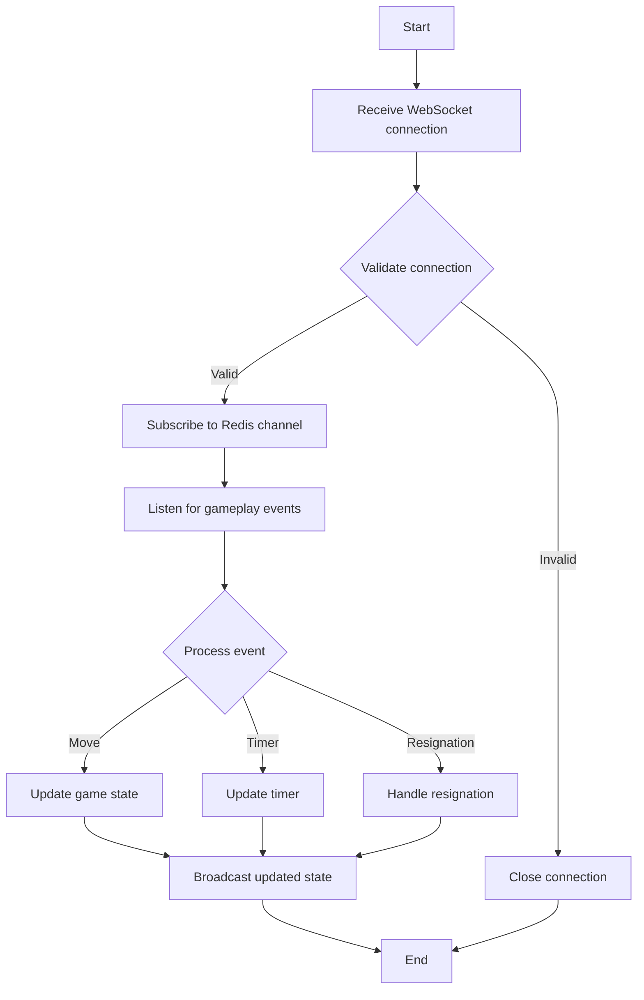
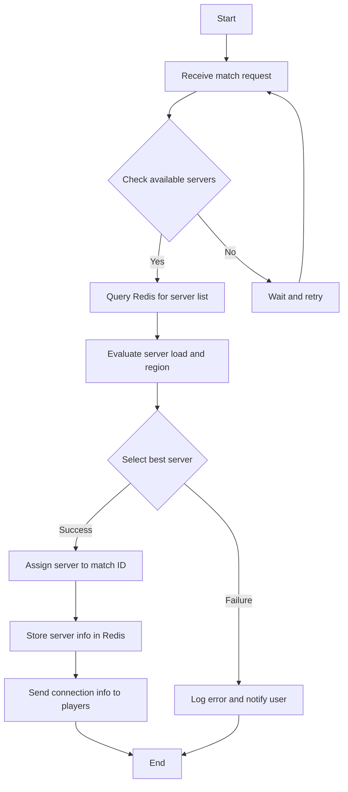
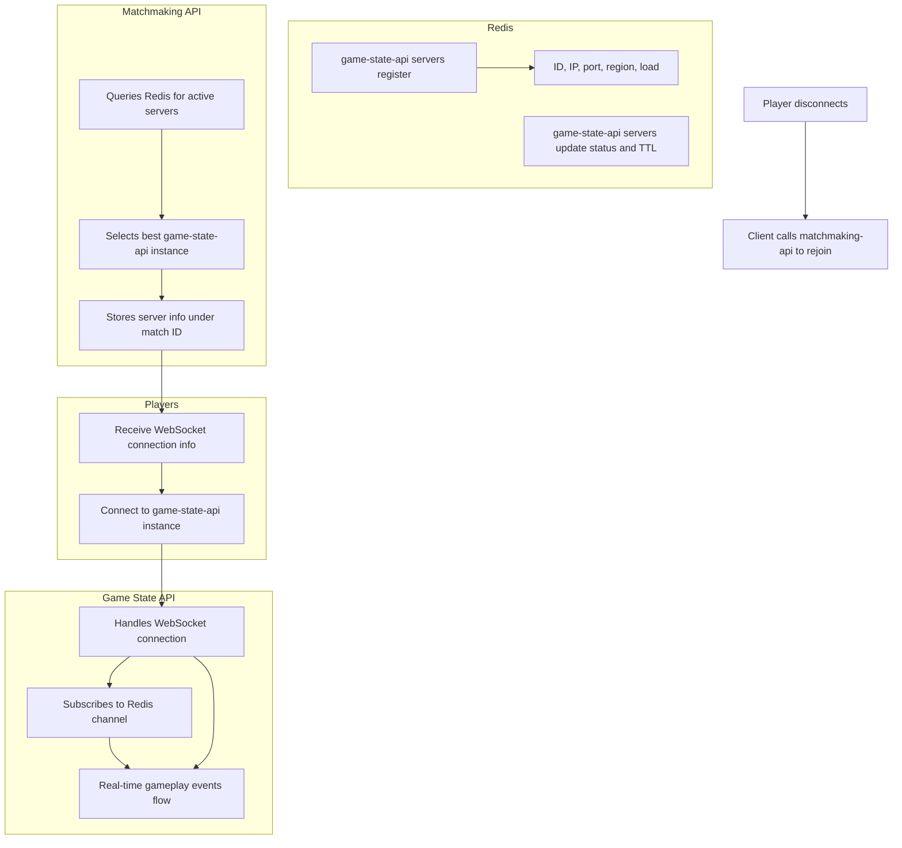

# Game State API Service

## Overview
This service is designed to sync game state in real-time, store moves, and manage timers for a chess application where users can place bets on the game. The system leverages WebSockets and Redis to ensure efficient and reliable communication between components.

## Features
- Real-time game state synchronization
- Move and timer storage
- WebSocket communication
- Redis-based server registration and matchmaking
- Region-aware and load-balanced server selection

## Architecture
The architecture consists of two main components:

1. **Game State API**: Handles WebSocket connections and manages game state.
2. **Matchmaking API**: Selects the best game state server for players to connect to.

## Dependencies
- Redis
- WebSockets

## Installation
1. Clone the repository.
2. Install dependencies.
3. Configure Redis and WebSocket settings.
4. Run the server.

## Usage
- **Registering Servers**: Game state API servers register themselves in Redis with their ID, IP, port, region, and load.
- **Heartbeat**: Servers update their status and TTL periodically to maintain active status.
- **Matchmaking**: The matchmaking API queries Redis to find the best server for a match, considering load and region.
- **Connection**: Players receive connection info and connect to the assigned game state API instance.
- **Gameplay**: All real-time events are managed through the game state API.
- **Reconnection**: If a player disconnects, they can reconnect using the matchmaking API to retrieve server info.

## System Flow Diagrams

### 1. Game State API Logic

### 2. Matchmaking Service Logic

### 3. Complete System Communication Flow

## Contributing
Contributions are welcome! Please submit a pull request or open an issue for any bugs or feature requests.

## License
This project is licensed under the MIT License.
