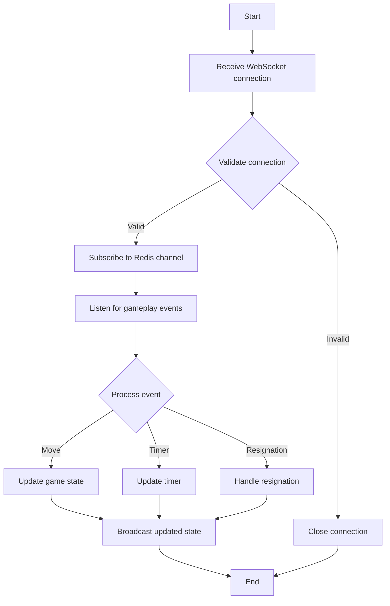
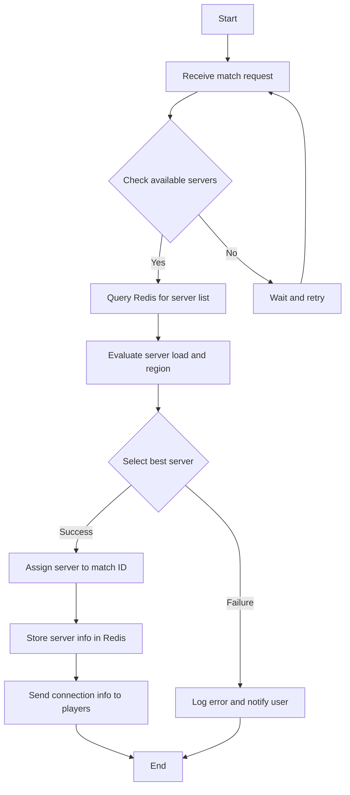
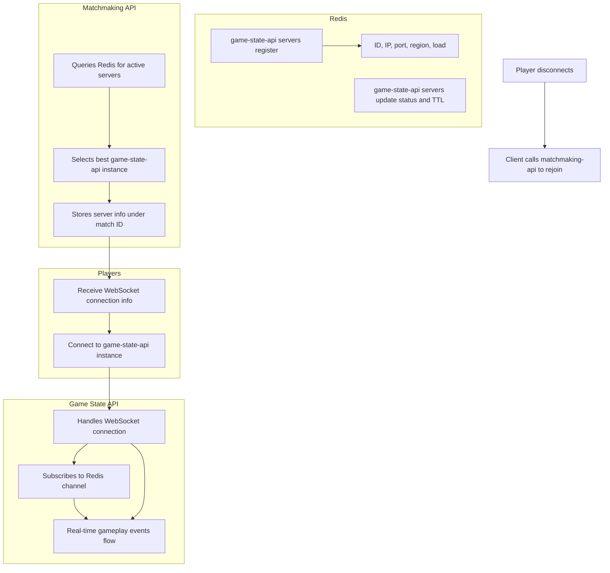

# Game State API Service

## Overview
This service is designed to sync game state in real-time, store moves, and manage timers for a chess application where users can place bets on the game. The system leverages WebSockets and Redis to ensure efficient and reliable communication between components.

## Features
- Real-time game state synchronization
- Move and timer storage
- WebSocket communication
- Redis-based server registration and matchmaking
- Region-aware and load-balanced server selection

## Architecture
The architecture consists of two main components:

1. **Game State API**: Handles WebSocket connections and manages game state.
2. **Matchmaking API**: Selects the best game state server for players to connect to.

## Dependencies
- Redis
- WebSockets

## Installation
1. Clone the repository.
2. Install dependencies.
3. Configure Redis and WebSocket settings.
4. Run the server.

## Usage
- **Registering Servers**: Game state API servers register themselves in Redis with their ID, IP, port, region, and load.
- **Heartbeat**: Servers update their status and TTL periodically to maintain active status.
- **Matchmaking**: The matchmaking API queries Redis to find the best server for a match, considering load and region.
- **Connection**: Players receive connection info and connect to the assigned game state API instance.
- **Gameplay**: All real-time events are managed through the game state API.
- **Reconnection**: If a player disconnects, they can reconnect using the matchmaking API to retrieve server info.

## System Flow Diagrams

### 1. Game State API Logic


### 2. Matchmaking Service Logic


### 3. Complete System Communication Flow


## Features

- Express-based REST API
- TypeScript with strict type checking
- Zod schema validation
- OpenAPI documentation with Scalar
- Environment configuration
- Health check endpoint
- Task management endpoints with pagination

## Using Prisma

This project uses Prisma as its ORM for database operations. The Prisma client is already configured and can be imported in your code as follows:

```typescript
import { prisma } from '../../prisma/client.ts'
```

### Example Usage

```typescript
// Query all users
const users = await prisma.user.findMany()

// Create a new record
const newUser = await prisma.user.create({
  data: {
    email: 'user@example.com',
    name: 'John Doe'
  }
})
```

## Useful Commands
- `deno run --reload -A npm:prisma@latest init --db` - Creates a prisma directory containing a schema.prisma file for your database models
- `deno run -A npm:prisma migrate dev --name init` - It creates a new SQL migration file for this migration & runs the SQL migration file against the database
- `deno run -A npm:prisma@latest db push` - Pushes the latest schema changes to the database
- `deno run -A npm:prisma@latest db pull` - Pulls the latest schema changes from the database
- `deno run -A npm:prisma@latest db reset` - Resets the database
- `deno run -A --env prisma/seed.ts` - Seeds the database
- `deno run -A npm:prisma studio` - Opens the Prisma Studio

The Prisma client is initialized in `prisma/client.ts` and is ready to use throughout the application. The client is configured to work with the database specified in your environment variables (`DATABASE_URL`).

## Getting Started

### Prerequisites

- [Deno](https://deno.land/) installed on your machine
- Git for version control

### Installation

1. Clone the repository
2. Copy `.env.example` to `.env` and update the values
3. Run the dev server:

```bash
deno task dev
```

The server will start on the configured port (default: 8000).

## API Documentation

Interactive API documentation is available at:
- dev: `http://localhost:8000/api-docs`
- Production: `https://auth-api.notpossiblelabs.com/api-docs`

The raw OpenAPI specification is available at `/api-docs/json`.

## Project Structure

```
auth-api/
├── src/
│   ├── deps.ts            # Centralized dependencies
│   ├── main.ts           # Application entry point
│   ├── lib/              # Shared utilities
│   │   └── types.ts      # Shared TypeScript types
│   └── routes/           # API routes
│       ├── health/       # Health check endpoint
│       │   ├── health.api.ts    # OpenAPI spec
│       │   └── health.routes.ts # Route handlers
│       └── tasks/        # Task management endpoints
│           ├── tasks.api.ts     # OpenAPI spec
│           └── tasks.routes.ts  # Route handlers
├── .env                  # Environment variables
└── deno.json            # Deno configuration
```

## Route Structure

Each route module consists of two files:
1. `*.routes.ts` - Contains the Express route handlers and validation logic
2. `*.api.ts` - Contains the OpenAPI specification for the routes

### Route Naming Convention

API routes follow a consistent naming pattern:
```typescript
// api.ts
const {Resource}{Method}Route: OpenAPIPath = {
  "/resource": {
    method: {
      // OpenAPI specification
    }
  }
};

// Example:
const TasksGetRoute: OpenAPIPath = {
  "/tasks": {
    get: {
      // OpenAPI specification for GET /tasks
    }
  }
};

const TasksPostRoute: OpenAPIPath = {
  "/tasks": {
    post: {
      // OpenAPI specification for POST /tasks
    }
  }
};
```

### Route Implementation Example
```typescript
// routes.ts
import { Router } from "npm:express@4";
import { z } from "../../deps.ts";

const router = Router();

router.get("/tasks", (req: Request<{}, {}, {}, PaginationParams>, res: Response) => {
  // Route implementation with typed request/response
});

export const tasksRouter = router;
```

## Type Safety

The project uses TypeScript with strict type checking:

1. Request/response types are enforced through TypeScript
2. Request bodies are validated using Zod schemas
3. OpenAPI documentation is type-safe through the OpenAPIPath type
4. Pagination parameters and responses are fully typed

## Dependencies

- Deno standard library
- Express.js framework
- Zod for schema validation
- Scalar for API documentation

## Environment Variables

| Variable    | Description        | Default     |
|-------------|--------------------|-------------|
| PORT        | Server port        | 8000        |
| NODE_ENV    | Environment        | dev |
| HOST        | Production host    | -           |
| LOG_LEVEL   | Logging level      | debug       |
| DATABASE_URL| Database connection| file:dev.db |

## Best Practices

### Pagination

#### Page-Based Pagination
All list endpoints should implement page-based pagination using `page` and `limit` query parameters:

```http
GET /api/tasks?page=2&limit=20
```

Parameters:
- `page` (default: 1): The page number to retrieve
- `limit` (default: 10, max: 100): Number of items per page

#### Pagination Response Format
Responses include both the data array and pagination metadata:

```json
{
  "data": [
    {
      "id": "123e4567-e89b-12d3-a456-426614174000",
      "title": "Example Task",
      "description": "Task description",
      "status": "pending",
      "priority": "high",
      "createdAt": "2024-03-29T10:00:00Z"
    }
  ],
  "pagination": {
    "total_records": 100,
    "current_page": 1,
    "total_pages": 10,
    "next_page": 2,
    "prev_page": null,
    "has_more": true
  }
}
```

The pagination metadata helps clients to:
- Track their position in the dataset
- Calculate the total number of requests needed
- Navigate between pages efficiently
- Determine if more data is available

#### Implementation Example
```typescript
interface PaginatedResponse<T> {
  data: T[];
  pagination: {
    total_records: number;
    current_page: number;
    total_pages: number;
    next_page: number | null;
    prev_page: number | null;
    has_more: boolean;
  };
}

router.get("/tasks", (req: Request<{}, {}, {}, PaginationParams>, res: Response) => {
  const page = Math.max(1, Number(req.query.page) || 1);
  const limit = Math.min(100, Math.max(1, Number(req.query.limit) || 10));
  
  // Calculate pagination metadata
  const startIndex = (page - 1) * limit;
  const endIndex = startIndex + limit;
  const totalRecords = tasks.length;
  const totalPages = Math.ceil(totalRecords / limit);
  
  const response: PaginatedResponse<Task> = {
    data: tasks.slice(startIndex, endIndex),
    pagination: {
      total_records: totalRecords,
      current_page: page,
      total_pages: totalPages,
      next_page: page < totalPages ? page + 1 : null,
      prev_page: page > 1 ? page - 1 : null,
      has_more: page < totalPages
    }
  };
  
  res.json(response);
});
```
